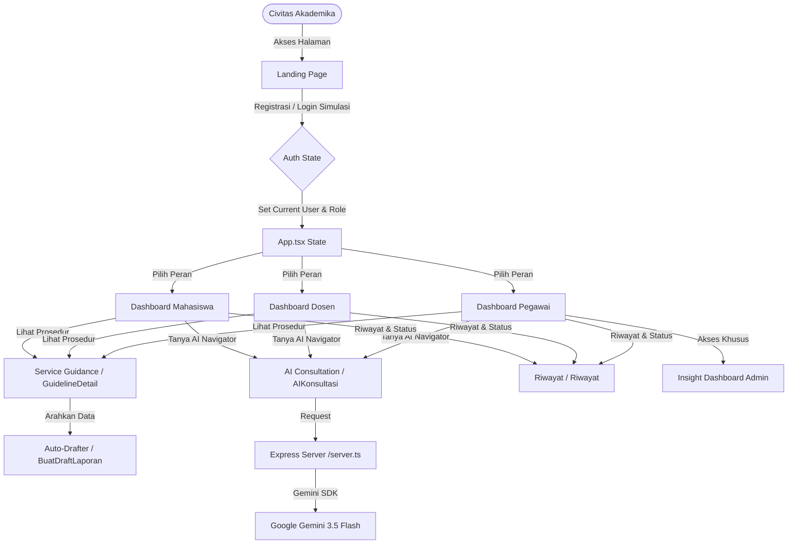

# 📑 DOKUMENTASI SISTEM CAMPUSCARE AI

CampusCare AI adalah platform *Smart Service Navigator* bertenaga AI yang membantu mahasiswa, dosen, dan pegawai universitas dalam menemukan layanan kampus secara cepat dan tepat sesuai dengan kendala atau kebutuhan mereka.

Dokumen ini menjelaskan arsitektur sistem, struktur data, panduan desain UI/UX, alur navigasi berbasis peran (role-based), persistensi state lokal, dan panduan menjalankan sistem.

---

## 🏛️ Arsitektur Aplikasi

Aplikasi ini dibangun menggunakan pola arsitektur **Single Page Application (SPA)** dengan integrasi backend Express untuk mengolah permintaan ke kecerdasan buatan (Gemini).



---

## 💾 State & Persistensi Data (LocalStorage)

Aplikasi ini menggunakan penyimpanan lokal (`localStorage`) untuk mensimulasikan sistem basis data yang dinamis secara client-side, menjadikannya responsif tanpa memerlukan server database relasional:

1. **Sesi Pengguna (`campus_care_current_user`)**:
   - Menyimpan objek `UserInfo` (Nama, NIM/NIP, Email, Peran) setelah login atau register.
   - Sesi bertahan saat halaman di-refresh, dengan tombol pintas *"Melanjutkan Sesi Sebelumnya"* di halaman depan.
2. **Draf Laporan (`campus_care_saved_drafts`)**:
   - Menyimpan seluruh berkas surat yang dirancang oleh civitas akademika.
   - Sinkronisasi perubahan status draf ("Draft", "Tindak Lanjut", "Selesai") secara langsung melalui dropdown di tab Riwayat.
3. **Riwayat Baca Panduan (`campus_care_viewed_guidelines`)**:
   - Mencatat alur layanan kampus yang terakhir dibuka oleh pengguna untuk kemudahan akses kembali.
4. **Bank Masalah Kampus (`campus_care_saved_problems`)**:
   - Menyimpan daftar aduan kritis civitas akademika secara dinamis. Menambahkan aduan baru dari panel admin akan langsung memperbarui bank data ini.

---

## 🎨 Panduan Desain & Palet Warna (UI/UX)

Desain antarmuka CampusCare AI mengadopsi estetika modern, profesional, dan bersih dengan skema warna yang diilhami oleh identitas akademis Telkom University:

*   **Warna Aksen Utama**: `Maroon (#991b1b / bg-rose-700 / text-rose-700)` - Representasi identitas kampus yang tegas dan dinamis.
*   **Warna Latar Belakang**: `Off-White (#f8fafc / bg-slate-50)` - Mengurangi kelelahan mata dan memberikan kesan bersih.
*   **Warna Teks Utama**: `Deep Navy / Charcoal (#0f172a / text-slate-900)` - Keterbacaan teks tingkat tinggi untuk konten administratif.
*   **Aksen Kecerdasan Buatan (AI)**: `Teal/Cyan (#0d9488 / text-teal-600)` - Digunakan khusus untuk menyoroti fitur-fitur pintar asisten AI Navigator.
*   **Glow & Glassmorphism**: Digunakan di dasbor admin gelap (`#0B1120`) untuk memberikan nuansa teknologi tingkat tinggi (premium feel).

---

## 👥 Alur Peran Pengguna (Role-based Flows)

Setiap pengguna yang masuk akan difilter kontennya secara otomatis berdasarkan peran yang mereka pilih:

### 1. Peran Mahasiswa
*   **Kategori Utama**: Akademik, Akun & SSO, Keuangan, LMS/CeLOE, Open Library, IT & Jaringan, Kemahasiswaan, Fasilitas.
*   **Sapaan Awal AI**: Memfokuskan bantuan pada KRS, UKT, Wifi, atau Surat Keterangan Aktif Kuliah.
*   **Otomatisasi Surat**: Menggunakan kolom **NIM** dan mengarahkan laporan ke unit Akademik/Kemahasiswaan.

### 2. Peran Dosen
*   **Kategori Utama**: LMS/CeLOE, Sistem Akademik, Akun & SSO, Penelitian & Pengabdian, Administrasi Dosen, IT & Jaringan, Ruang & Fasilitas.
*   **Sapaan Awal AI**: Memfokuskan bantuan pada presensi LMS, pengajuan BKD di iGracias, hibah penelitian (PPM), atau kepangkatan (JAFA).
*   **Otomatisasi Surat**: Menggunakan kolom **NIP** dan mengarahkan surat pengantar ke Lembaga PPM atau Direktorat Kepegawaian.

### 3. Peran Pegawai Kampus (Staf)
*   **Kategori Utama**: Administrasi Internal, IT & Sistem, Logistik & Fasilitas, SDM, Helpdesk Unit, Knowledge Base, Insight Admin.
*   **Sapaan Awal AI**: Memfokuskan bantuan pada Nota Dinas, logistik ATK, slip gaji, cuti, atau resolusi tiket keluhan civitas.
*   **Akses Khusus**: Menampilkan tombol menu **Insight Admin** untuk memonitor tren keluhan kampus secara waktu nyata (real-time).

---

## 🕹️ Panduan Alur Demo Juri (Demo Flow Checklist)

1. **Masuk ke Aplikasi**: Klik tombol **Quick Demo Login** untuk peran **Mahasiswa** di Landing Page.
2. **Konsultasi AI**: Di tab **AI Navigator**, ketik keluhan *"UKT saya belum terverifikasi"*. Asisten AI akan merespons dan menampilkan kartu deteksi alur *"Pengajuan Keringanan & Cicilan UKT"*.
3. **Membaca Prosedur**: Klik **Lihat Panduan** pada kartu solusi AI untuk membuka **Service Guidance**. Tinjau alur langkah-demi-langkah dan berkas persyaratannya.
4. **Penyusunan Surat**: Klik **Buat Draft Laporan**. Detail profil mahasiswa (Nama, NIM, Email) akan terisi otomatis. Tulis deskripsi keluhan singkat, lalu klik **Simpan ke Riwayat**.
5. **Manajemen Riwayat**: Masuk ke tab **Riwayat**, periksa surat yang telah tersimpan. Coba perbarui statusnya dari *"Draft"* menjadi *"Selesai"*.
6. **Insight Dashboard Admin**: Logout dari profil Mahasiswa, lalu gunakan **Quick Demo Login** sebagai **Pegawai Kampus**. Masuk ke tab **Insight Admin** untuk memantau visualisasi grafik, melihat **Campus Problem Bank**, dan menguji CMS Knowledge Base.

---

## ⚙️ Panduan Menjalankan Sistem Secara Lokal

1.  **Instalasi Node Modules**:
    ```bash
    npm install
    ```
2.  **Konfigurasi Variabel Lingkungan**:
    Buat berkas bernama `.env` di folder root:
    ```env
    GEMINI_API_KEY=isi_kunci_api_gemini_anda
    PORT=3000
    ```
3.  **Mode Pengembangan (Development Mode)**:
    ```bash
    npm run dev
    ```
4.  **Mode Kompilasi Produksi (Production Build)**:
    ```bash
    npm run build
    ```

---
© 2026 CampusCare AI — Satu Pintu untuk Menemukan Layanan Kampus yang Tepat.
