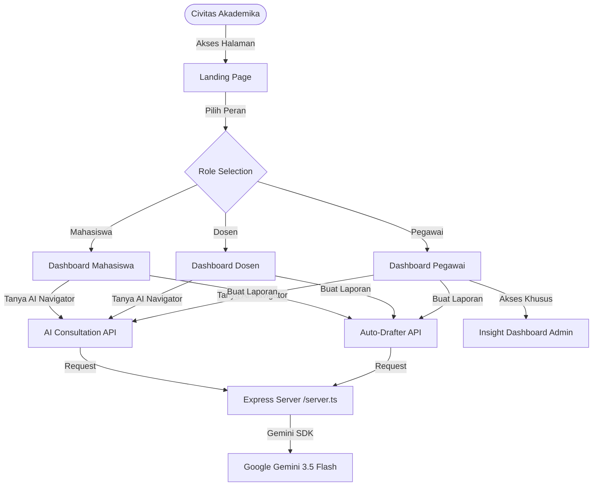

# 📑 DOKUMENTASI SISTEM CAMPUSCARE AI

CampusCare AI adalah platform *Smart Service Navigator* bertenaga AI yang membantu mahasiswa, dosen, dan pegawai universitas dalam menemukan layanan kampus secara cepat dan tepat sesuai dengan kendala atau kebutuhan mereka.

Dokumen ini menjelaskan arsitektur sistem, struktur data, panduan desain UI/UX, alur navigasi berbasis peran (role-based), dan panduan lengkap untuk melakukan deploy ke GitHub.

---

## 🏛️ Arsitektur Aplikasi

Aplikasi ini dibangun menggunakan pola arsitektur **Single Page Application (SPA)** dengan integrasi backend Express untuk mengolah permintaan ke kecerdasan buatan (Gemini).



---

## 🎨 Panduan Desain & Palet Warna (UI/UX)

Desain antarmuka CampusCare AI mengadopsi estetika modern, profesional, dan bersih dengan skema warna yang diilhami oleh identitas akademis Telkom University:

*   **Warna Aksen Utama**: `Maroon (#991b1b / bg-rose-700 / text-rose-700)` - Representasi identitas kampus yang tegas dan dinamis.
*   **Warna Latar Belakang**: `Off-White (#f8fafc / bg-slate-50)` - Mengurangi kelelahan mata dan memberikan kesan bersih.
*   **Warna Teks Utama**: `Deep Navy / Charcoal (#0f172a / text-slate-900)` - Keterbacaan teks tingkat tinggi untuk konten administratif.
*   **Aksen Kecerdasan Buatan (AI)**: `Teal/Cyan (#0d9488 / text-teal-600)` - Digunakan khusus untuk menyoroti fitur-fitur pintar asisten AI Navigator.

---

## 👥 Alur Peran Pengguna (Role-based Flows)

Setiap pengguna yang masuk akan difilter kontennya secara otomatis berdasarkan peran yang mereka pilih:

### 1. Peran Mahasiswa
*   **Kategori Utama**: Akademik, Akun & SSO, Keuangan, LMS/CeLOE, Open Library, IT & Jaringan, Kemahasiswaan, Fasilitas.
*   **Sapaan Awal AI**: Memfokuskan bantuan pada KRS, UKT, Wifi, atau Surat Keterangan Aktif Kuliah.
*   **Otomatisasi Surat**: Menggunakan kolom **NIM** dan mengarahkan laporan ke unit Akademik/Kemahasiswaan.

### 2. Peran Dosen
*   **Kategori Utama**: LMS/CeLOE, Sistem Akademik, Akun & SSO, Penelitian & Pengabdian, Administrasi Dosen, IT & Jaringan, Ruang & Fasilitas.
*   **Sapaan Awal AI**: Memfokuskan bantuan pada presensi LMS, pengajuan BKD di iGracias, hibah penelitian (PPM), atau kepangkatan (JAFA).
*   **Otomatisasi Surat**: Menggunakan kolom **NIP** dan mengarahkan surat pengantar ke Lembaga PPM atau Direktorat Kepegawaian.

### 3. Peran Pegawai Kampus (Staf)
*   **Kategori Utama**: Administrasi Internal, IT & Sistem, Logistik & Fasilitas, SDM, Helpdesk Unit, Knowledge Base, Insight Admin.
*   **Sapaan Awal AI**: Memfokuskan bantuan pada Nota Dinas, logistik ATK, slip gaji, cuti, atau resolusi tiket keluhan civitas.
*   **Akses Khusus**: Menampilkan tombol menu **Insight Admin** untuk memonitor tren keluhan kampus secara waktu nyata (real-time).
*   **Otomatisasi Surat**: Menggunakan kolom **NIP** dan mengarahkan draf surat ke Direktorat SDM atau Biro Umum.

---

## 🛠️ Panduan Menjalankan Sistem Secara Lokal

1.  **Instalasi Node Modules**:
    ```bash
    npm install
    ```
2.  **Konfigurasi Variabel Lingkungan**:
    Buat berkas bernama `.env` di folder root:
    ```env
    GEMINI_API_KEY=isi_kunci_api_gemini_anda
    PORT=3000
    ```
3.  **Mode Pengembangan (Development Mode)**:
    ```bash
    npm run dev
    ```
4.  **Mode Kompilasi Produksi (Production Build)**:
    ```bash
    npm run build
    npm run start
    ```

---

## 🐙 Panduan Deployment ke GitHub

Untuk melakukan commit semua perubahan terbaru (termasuk fitur Landing Page dan perbaikan bug sistem) serta mengunggahnya ke repositori GitHub Anda, ikuti perintah Git berikut:

1.  **Simpan Semua Perubahan**:
    ```bash
    git add .
    ```
2.  **Buat Pesan Commit Resmi**:
    ```bash
    git commit -m "feat: implementasi sistem navigator kampus berbasis role dan visualisasi grafik admin"
    ```
3.  **Unggah ke Cabang Utama**:
    ```bash
    git push origin main
    ```

---
© 2026 CampusCare AI — Satu Pintu untuk Menemukan Layanan Kampus yang Tepat.
